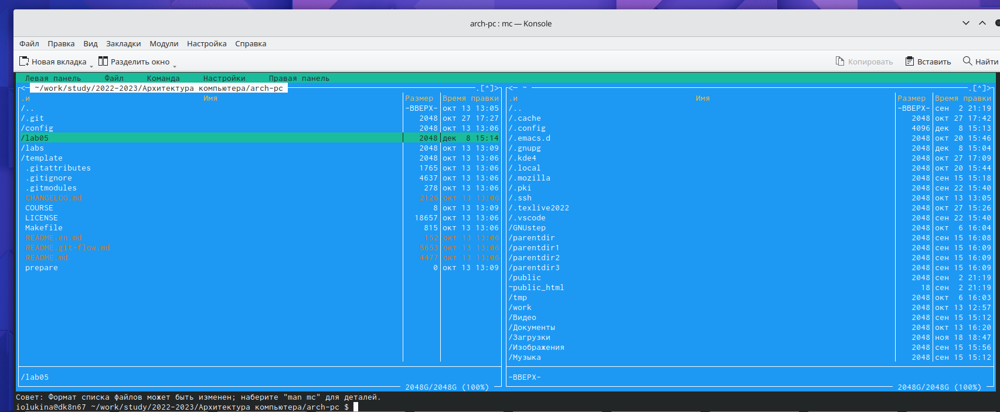
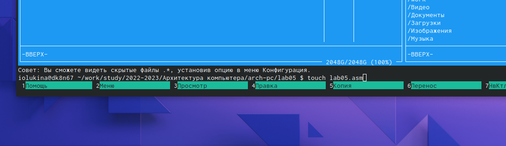
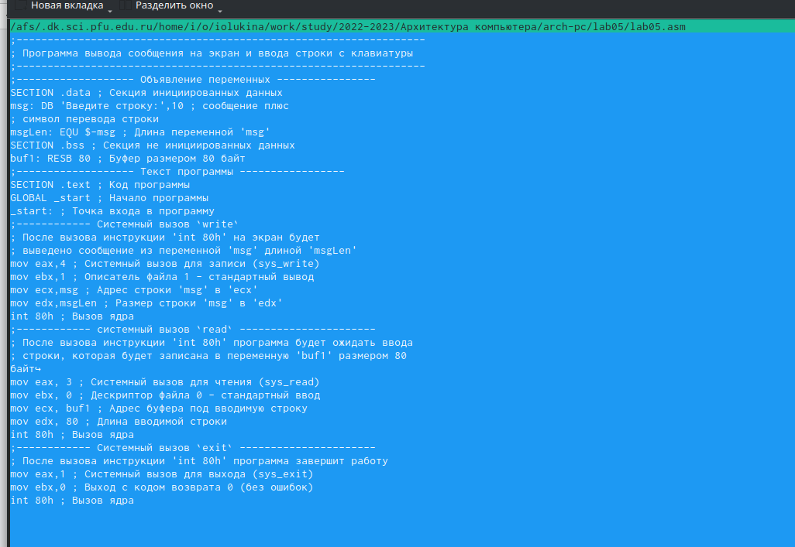
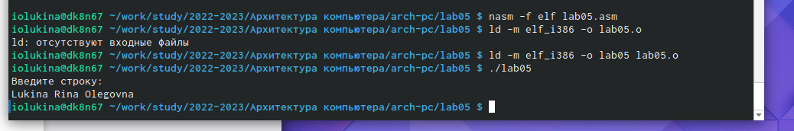
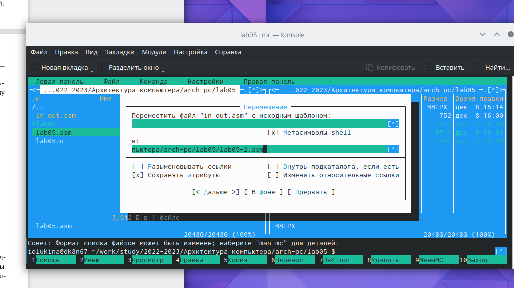

---
## Front matter
title: "Отчет по лабораторной работе №5"
subtitle: "Архитектура вычислительных систем"
author: "Лукина Ирина Олеговна"

## Generic otions
lang: ru-RU
toc-title: "Содержание"

## Bibliography
bibliography: bib/cite.bib
csl: pandoc/csl/gost-r-7-0-5-2008-numeric.csl

## Pdf output format
toc: true # Table of contents
toc-depth: 2
lof: true # List of figures
lot: true # List of tables
fontsize: 12pt
linestretch: 1.5
papersize: a4
documentclass: scrreprt
## I18n polyglossia
polyglossia-lang:
  name: russian
  options:
	- spelling=modern
	- babelshorthands=true
polyglossia-otherlangs:
  name: english
## I18n babel
babel-lang: russian
babel-otherlangs: english
## Fonts
mainfont: PT Serif
romanfont: PT Serif
sansfont: PT Sans
monofont: PT Mono
mainfontoptions: Ligatures=TeX
romanfontoptions: Ligatures=TeXcd ~/work/study/2022-2023/"Арзхитектура компьютера"/arch-pc/

sansfontoptions: Ligatures=TeX,Scale=MatchLowercase
monofontoptions: Scale=MatchLowercase,Scale=0.9
## Biblatex
biblatex: true
biblio-style: "gost-numeric"
biblatexoptions:
  - parentracker=true
  - backend=biber
  - hyperref=auto
  - language=auto
  - autolang=other*
  - citestyle=gost-numeric
## Pandoc-crossref LaTeX customization
figureTitle: "Рис."
tableTitle: "Таблица"
listingTitle: "Листинг"
lofTitle: "Список иллюстраций"
lotTitle: "Список таблиц"
lolTitle: "Листинги"
## Misc options
indent: true
header-includes:
  - \usepackage{indentfirst}
  - \usepackage{float} # keep figures where there are in the text
  - \floatplacement{figure}{H} # keep figures where there are in the text
---

# Цель работы

Целью работы является приобретение практических навыков работы в  Midnight Commander и освоение инструкций языка aссемблера mow и int.

# Выполнение лабораторной работы

1. Введем в терминале команду mc и откроем Midnight Commander:

{ #fig:001 width=70% }

2. Переходим в каталог, созданный при выполнении работы №4 и создаем папку lab05:

{ #fig:002 width=70% }

3. С помощью команды touch создаем файл lab05.asm:

{ #fig:003 width=70% }

4. Клавишей F4 откроем созданный файл и отредактируем его, введя текст программы из листинга 6.1, сохраняем изменения и закрываем:

{ #fig:004 width=70% }

5. Клавиша F3 откроет файл. Просматриваем и убеждаемся, что он содержит текст программы.

6. Транслируем текст программы lab05.asm в объектный файл. Выполняем его компоновку и запускаем получившийся файл. Терминал ожидает ввода после "Введите строку:". Вводим свои ФИО:

{ #fig:005 width=70% }

7. Скачиваем файл in_out.asm и копируем его в тот же каталог, что и файл с программой, т.к. для корректной работы он долже лежать в этом каталоге. После этого создаем копию файла lab05.asm  и даем ему название lab05-2.asm:

{ #fig:006 width=70% }

8. Исправляем в новом файле текст с использованием подпрограмм из внешнего файла в соответствии с листингом 6.2. Создаем исполняемый файл и проверяем его работу.

{ #fig:007 width=70% }

# Выводы
В ходе выполнения лабораторной работы мы научились работать с Midnight Commander и освоили инструкции языка mow и  int

