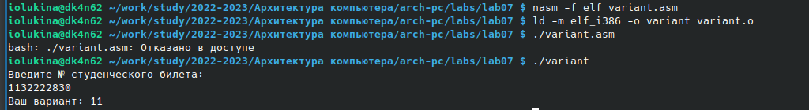

---
## Front matter
title: "Отчет по лабораторной работе №6"
subtitle: "Архитектура компьютера"
author: "Лукина Ирина Олеговна"

## Generic otions
lang: ru-RU
toc-title: "Содержание"

## Bibliography
bibliography: bib/cite.bib
csl: pandoc/csl/gost-r-7-0-5-2008-numeric.csl

## Pdf output format
toc: true # Table of contents
toc-depth: 2
lof: true # List of figures
lot: true # List of tables
fontsize: 12pt
linestretch: 1.5
papersize: a4
documentclass: scrreprt
## I18n polyglossia
polyglossia-lang:
  name: russian
  options:
	- spelling=modern
	- babelshorthands=true
polyglossia-otherlangs:
  name: english
## I18n babel
babel-lang: russian
babel-otherlangs: english
## Fonts
mainfont: PT Serif
romanfont: PT Serif
sansfont: PT Sans
monofont: PT Mono
mainfontoptions: Ligatures=TeX
romanfontoptions: Ligatures=TeX
sansfontoptions: Ligatures=TeX,Scale=MatchLowercase
monofontoptions: Scale=MatchLowercase,Scale=0.9
## Biblatex
biblatex: true
biblio-style: "gost-numeric"
biblatexoptions:
  - parentracker=true
  - backend=biber
  - hyperref=auto
  - language=auto
  - autolang=other*
  - citestyle=gost-numeric
## Pandoc-crossref LaTeX customization
figureTitle: "Рис."
tableTitle: "Таблица"
listingTitle: "Листинг"
lofTitle: "Список иллюстраций"
lotTitle: "Список таблиц"
lolTitle: "Листинги"
## Misc options
indent: true
header-includes:
  - \usepackage{indentfirst}
  - \usepackage{float} # keep figures where there are in the text
  - \floatplacement{figure}{H} # keep figures where there are in the text
---

# Цель работы

Освоение арифметических инструкций языка ассемблера NASM.

# Выполнение лабораторной работы

1. Переходим в созданый каталог работы №6 и создаем файл lab7-1.asm:

{ #fig:001 width=90% }

2. Вводим в созданный файл текст программы из листинга 7.1, создаем исполняемый файл и запускаем его:

{ #fig:002 width=90% }

3. Заменяем строки в программе файла и создаем исполняемый файл.

4. Создаем файл lab7-2.asm, вводим в него программу из листинга 7.2, создаем исполняемый файл и запускаем его:

{ #fig:003 width=90% }

5. Заменяем строки по аналогии с первой программой во второй и получаем результат:

{ #fig:004 width=90% }

6. Теперь заменим функцию iprintLF на iprint, создадим исполняемый файл, запустим и сравним функции:

{ #fig:005 width=90% }

7. Создаем файл lab7-3.asm, введем в него программу из листинга 7.3, создадим исполняемый файл и выведем результат

{ #fig:006 width=90% }

8. Создадим новый файл variant.asm, введем в него программу из листинга 7.4, создадим исполняемый файл, запустим и введем запрашвиаемые данные:

{ #fig:007 width=90% }

{ #fig:008 width=90% }

ВОПРОСЫ

1. mov  eax, rem call sprint
 
2. mov ecx,x отвечает за запись входной переменной в регистр;
   move edx,80 отвечает за запись размера переменной в регистр;
   call sread отвечает за вызов процедуры чтения данных;
   
3. CALL ATOI это функция, которая преобразует ascii код символа в целое число и записывает результат в еах регистр.

4. Следубщие строки: хоr edx, edx mov ebx, 20 divebx inc ebx

5. Остаток деления записывается в регистр ebx    

6. Инструкция inc edx используется для увеличения операнда на единицу.

7. За вывод на экран отвечают строки rem call sprint move eax, mov eax, edx call iprintLF
# Выводы

В ходе выполнения лабораторной работы я освоила инструкции NASM

# Список литературы{.unnumbered}

::: {#refs}
:::
